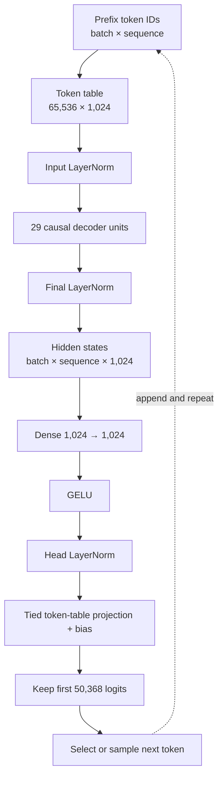

# Decoder architecture lab

Your task is to implement `model.py` and run the supplied anonymous checkpoint
without using a pretrained-model implementation from another library. You may
use PyTorch, `safetensors`, and `tokenizers`.

## Required model

The model is a decoder-only Transformer. It accepts a token prefix, returns
next-token logits, and supports autoregressive generation.

The exact dimensions are in `model.json`. For this artifact they are:

| Quantity | Value |
|---|---:|
| Stored vocabulary rows | 65,536 |
| Returned vocabulary logits | 50,368 |
| Hidden width | 1,024 |
| Attention heads | 16 |
| Width per head | 64 |
| Expanded MLP width | 2,624 |
| Transformer units | 29 |
| Maximum sequence length | 7,999 |
| Local history window | 64 tokens |
| Global-attention interval | Every third unit |



Each decoder unit has two pre-normalized residual branches:

```mermaid
flowchart LR
    X[Input x] --> N1[Pre-attention LayerNorm]
    X --> R1((+))
    N1 --> Q[Separate Q, K, V projections]
    Q --> A[Causal attention<br/>global or local history]
    A --> O[Output projection]
    O --> R1
    R1 --> Y[Intermediate y]
    Y --> N2[Pre-MLP LayerNorm]
    Y --> R2((+))
    N2 --> W1[Linear 1,024 → 5,248]
    W1 --> S[Split into two 2,624-wide tensors]
    S --> M[GELU first half × second half]
    M --> W2[Linear 2,624 → 1,024]
    W2 --> R2
    R2 --> Z[Unit output]
```



Unit 0 applies attention directly to the embedding output; units after it use
the pre-attention LayerNorm. Every unit uses the pre-MLP LayerNorm.

All attention is causal. Units whose zero-based index is divisible by three may
attend to the complete prefix. Other units may attend only to the current token
and the preceding local history specified in `model.json`. Padding keys must
never be attended to.

Apply rotary position information to queries and keys after splitting into 16
heads. Read the rotary bases from `model.json`; do not hard-code them.

## Checkpoint contract

Load `safetensor_decoder.safetensors`. Your module names must match its neutral
tensor names, including `tokens`, `units`, `mix`, `query`, `key`, `value`,
`expand`, and `contract`. The token table has more stored rows than the
tokenizer uses. Return only the first `vocabulary_size` logits.

## Generation

For greedy decoding, repeatedly take the last-position logits, select the
largest value, append that token, and stop at `eos_id` or the requested length.
Optional temperature and top-k sampling may be implemented afterward. A KV
cache is not required for the reference lab.

## Input and output examples

### `forward()`

Tokenizing `Once upon a time` produces:

```python
input_ids = torch.tensor([[
    50281, 10758, 2220, 247, 673, 50282
]])
# tokens: [CLS] Once Ġupon Ġa Ġtime [SEP]
```

Calling `model(input_ids)` returns:

```python
ModelOutput(
    logits=...,         # shape [1, 6, 50_368]
    hidden_states=...,  # shape [1, 6, 1_024]
)
```

`logits[0, position]` predicts the token following that position. For
generation, only `logits[:, -1]` is used to choose the next token.

### `generate()`

With greedy decoding and three new tokens:

```python
generated = model.generate(input_ids, max_new_tokens=3, temperature=0)
```

The verified output is:

```python
generated = torch.tensor([[
    50281, 10758, 2220, 247, 673, 50282, 13, 627, 369
]])
```

```text
Input:  Once upon a time
Output: Once upon a time, there was
```

The generated tensor contains the original six-token prefix followed by three
new IDs. Its shape is therefore `[1, 9]`; generation does not return a
`ModelOutput`.

For a batch, every row receives one new token per iteration. Generation stops
when the requested count is reached, the maximum sequence length is reached,
or every row produces `eos_id` in the same iteration.

## Completion criteria

- All TODOs in `model.py` are implemented.
- Causal, padding, and local-history masks are correct.
- Earlier logits do not change when later tokens are appended.
- `forward` and greedy `generate` work with the supplied checkpoint.
- `python inference.py . "Once upon a time" --max-new-tokens 20` runs.
- The implementation uses the supplied weights rather than another model
  library.
