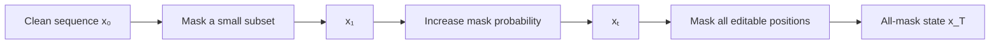
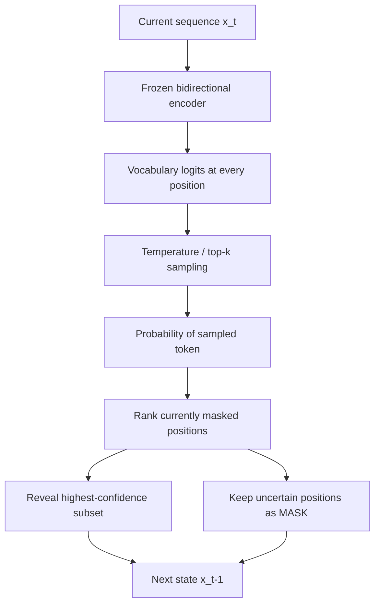

# Masked language diffusion lab

Implement the absorbing-mask diffusion process in `diffusion.py`. This lab is
a continuation of the Encoder architecture lab. The included `model.py` is the
same unfinished scaffold: solve that lab first, then replace it with your
completed `Encoder/model.py`. The diffusion lab does not publish the encoder
implementation.

The model files are reused directly from
[`ai-department-lpnu/encoder-lab`](https://huggingface.co/ai-department-lpnu/encoder-lab):

- `model.json`;
- `safetensor_encoder.safetensors`;
- `tokenizer.json`;
- `special_tokens_map.json`.

`inference.py` downloads those files on first use. This repository intentionally
contains no copy of the model tensors.

The encoder repository is currently private. Students must be granted access
and authenticate once with `hf auth login` before running `inference.py`.

Your working directory should therefore contain:

```text
Diffusion_LM/
├── diffusion.py      # implement this lab
├── inference.py
├── model.py          # replace with your solved Encoder/model.py
└── requirements.txt
```

## Objective

Turn a frozen bidirectional masked-language encoder into an iterative text
denoiser. `[MASK]` is an absorbing noise state. The forward process gradually
replaces editable tokens by `[MASK]`; the reverse process predicts masked
tokens and reveals the most confident predictions over several steps.

This is an inference-only masked diffusion sampler. The backbone has not been
trained with timestep conditioning, so the exercise focuses on diffusion
mechanics, reconstruction, and infilling rather than state-of-the-art
unconditional generation.

## Forward process



Use a cosine schedule. `cosine_mask_ratio(step, total_steps)` describes the
fraction that remains masked during reverse sampling:

```text
r(step) = cos²(π · step / (2 · total_steps))
```

The corresponding forward corruption probability at timestep `t` is
`1 - r(t)`. Only positions selected by `editable_mask` may be corrupted.

## Reverse diffusion step



For each batch item, one call to `diffusion_step` must:

1. Run the encoder once over the complete current sequence.
2. Prevent `[MASK]`, padding, and boundary tokens from being sampled.
3. Select greedy candidates when `temperature <= 0`; otherwise sample from
   temperature-scaled, optionally top-k-filtered probabilities.
4. Record each candidate's probability as its confidence.
5. Compute the target number of remaining masks from the cosine schedule.
6. Reveal the highest-confidence currently masked positions.
7. Leave prompt, boundary, padding, and previously revealed positions intact.

The process is monotonic: a revealed token is not masked again.

## Tensor shapes

| Value | Shape |
|---|---|
| `input_ids` | `[batch, sequence]` |
| `editable_mask` | `[batch, sequence]`, boolean |
| Encoder logits | `[batch, sequence, 50,368]` |
| Sampled IDs | `[batch, sequence]` |
| Confidence | `[batch, sequence]` |
| Remaining masks | `[batch]` |

Input and output always have the same `[batch, sequence]` shape. Diffusion
replaces tokens in existing positions; it never appends tokens or changes the
sequence length.

## Input and output examples

### Text infilling

The CLI input must contain at least one literal `[MASK]` token:

```text
Input:  Paris is the [MASK] of France.
Output: Paris is the capital of France.
```

With this tokenizer, the input and final output are:

```python
input_ids = torch.tensor([[
    50281, 36062, 310, 253, 50284, 273, 6181, 15, 50282
]])

#                        [MASK]
editable_mask = torch.tensor([[
    False, False, False, False, True, False, False, False, False
]])

final_ids = torch.tensor([[
    50281, 36062, 310, 253, 5347, 273, 6181, 15, 50282
]])
#                                  capital
```

Only position 4 is editable. The reverse process must preserve every other
token ID exactly.

### One `diffusion_step`

The following uses small illustrative token IDs. Here, `99` is `[MASK]`, `1`
and `2` are protected boundary tokens, and there are four editable positions:

```python
input_ids = torch.tensor([[1, 99, 99, 99, 99, 2]])
editable_mask = torch.tensor([[False, True, True, True, True, False]])
```

Suppose the encoder samples these candidates and confidences:

```python
sampled_ids = torch.tensor([[8, 10, 11, 12, 13, 7]])
confidence  = torch.tensor([[0.2, .95, .40, .70, .85, .3]])
```

For `step=1` and `total_steps=4`, the cosine schedule requests three remaining
masks. The step therefore reveals one token: candidate `10`, because `.95` is
the highest confidence among the four currently masked positions.

```python
DiffusionStepOutput(
    input_ids=torch.tensor([[1, 10, 99, 99, 99, 2]]),
    sampled_ids=torch.tensor([[8, 10, 11, 12, 13, 7]]),
    confidence=torch.tensor([[0.2, .95, .40, .70, .85, .3]]),
    remaining_masks=torch.tensor([3]),
)
```

Candidates at protected or already revealed positions are ignored. Only
positions satisfying both `editable_mask` and `input_ids == mask_id` may
change.

### Complete reverse trajectory

With four editable positions and four steps, one possible trajectory is:

```text
history[0]: [CLS] [MASK] [MASK] [MASK] [MASK] [SEP]
history[1]: [CLS] The    [MASK] [MASK] [MASK] [SEP]
history[2]: [CLS] The    small  [MASK] [MASK] [SEP]
history[3]: [CLS] The    small  brown  dog    [SEP]
history[4]: [CLS] The    small  brown  dog    [SEP]
```

`diffuse()` returns:

```python
DiffusionOutput(
    input_ids=history[-1],       # final sequence with no editable [MASK]
    history=tuple(history),      # initial state plus one state per step
)
```

Consequently, `len(output.history) == steps + 1` and
`output.input_ids.shape == input_ids.shape`.

### Forward corruption

`corrupt()` takes clean token IDs and returns another tensor of the same shape:

```text
clean_ids:  [CLS] The small brown dog [SEP]
editable:          yes yes   yes   yes

at low noise:  [CLS] The [MASK] brown dog    [SEP]
at high noise: [CLS] [MASK] [MASK] [MASK] dog [SEP]
at final noise:[CLS] [MASK] [MASK] [MASK] [MASK] [SEP]
```

`False` positions in `editable_mask`, such as `[CLS]` and `[SEP]`, must be
identical in the input and output.

## Completion criteria

- Implement every `NotImplementedError` in `diffusion.py`.
- Schedule endpoints are exactly `r(0) = 1` and `r(T) = 0`.
- Forward corruption never changes protected positions.
- Reverse steps never change prompt or previously revealed positions.
- The number of `[MASK]` tokens decreases according to the schedule.
- No `[MASK]` tokens remain after the last step.
- Seeded sampling is reproducible.
- Batched sequences may have different numbers of editable positions.
- The encoder is evaluated under `torch.inference_mode()` and is not trained.

Example after completing `diffusion.py`:

```bash
python inference.py "Paris is the [MASK] of France." \
  --steps 8 --temperature 0
```
