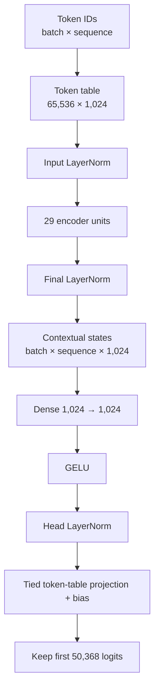
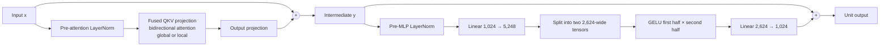

# Encoder architecture lab

Your task is to implement `model.py` and run the supplied anonymous checkpoint
without using a pretrained-model implementation from another library. You may
use PyTorch, `safetensors`, and `tokenizers`.

## Required model

The model is an encoder-only Transformer. It accepts `input_ids` and an optional
padding mask and returns contextual hidden states and vocabulary logits.

The exact dimensions are in `model.json`. For this artifact they are:

| Quantity | Value |
|---|---:|
| Stored vocabulary rows | 65,536 |
| Returned vocabulary logits | 50,368 |
| Hidden width | 1,024 |
| Attention heads | 16 |
| Width per head | 64 |
| Expanded MLP width | 2,624 |
| Transformer units | 29 |
| Maximum sequence length | 7,999 |
| Local radius | 64 tokens per side |
| Global-attention interval | Every third unit |

Each encoder unit has two pre-normalized residual branches:

Unit 0 applies attention directly to the embedding output; units after it use
the pre-attention LayerNorm. Every unit uses the pre-MLP LayerNorm.

Units whose zero-based index is divisible by three use full bidirectional
attention. Other units use bidirectional local attention: a token may attend up
to 64 positions left and 64 positions right. Padding keys must never be
attended to.

Apply rotary position information to queries and keys after splitting into 16
heads. Read the rotary bases from `model.json`; do not hard-code them.

## Checkpoint contract

Load `safetensor_encoder.safetensors`. Your module names must match its neutral
tensor names, including `tokens`, `units`, `mix`, `expand`, and `contract`.
The token table has more stored rows than the tokenizer uses. Return only the
first `vocabulary_size` logits.

## Completion criteria

- All TODOs in `model.py` are implemented.
- Padding and local-attention masks work for batches with different lengths.
- `forward` returns hidden states and logits with the documented shapes.
- `python inference.py . "A short example"` runs successfully.
- The implementation uses the supplied weights rather than another model
  library.
