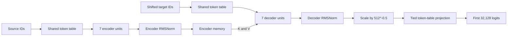
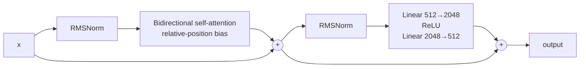
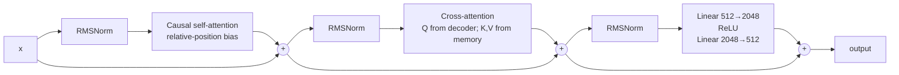

# Encoder-decoder architecture lab

Implement `model.py` using plain PyTorch and the supplied anonymous checkpoint.
Do not use a pretrained-model implementation from another library.

## Dimensions

| Quantity | Value |
|---|---:|
| Stored / usable vocabulary | 40,000 / 32,128 |
| Hidden width | 512 |
| Heads / head width | 8 / 64 |
| Feed-forward width | 2,048 |
| Encoder / decoder units | 7 / 7 |
| Relative buckets / maximum distance | 32 / 128 |



### Encoder unit



### Decoder unit



## Required behavior

- Use separate bias-free query, key, value, and output projections.
- Do not scale attention scores by `1/sqrt(head_width)`.
- Bucket relative positions logarithmically and look up a bias per head.
- RMSNorm uses no mean subtraction and no additive bias.
- Mask encoder padding in encoder self-attention and decoder cross-attention.
- Apply a causal mask in decoder self-attention.
- Begin generation with `decoder_start_id` and stop at `eos_id` or the length
  limit.
- Return only the first `vocabulary_size` logits even though more token rows are
  stored.

Load `safetensor_encoder_decoder.safetensors`. Module names must match its
neutral hierarchy: `tokens`, `encoder_units`, `decoder_units`, `self_mix`,
`cross_mix`, `feed_in`, `feed_out`, and the final normalization modules.

## Input and output examples

### Source input

Tokenizing the translation instruction produces:

```python
input_ids = torch.tensor([[
    13959, 1566, 12, 2968, 10, 37, 629, 19, 1245, 1
]])
# translate English to German: The house is nice </s>
```

The source has shape `[1, 10]`. `encode(input_ids)` returns encoder memory with
shape `[1, 10, 512]` plus the source padding mask.

### Teacher-forced `forward()`

`forward()` requires a separate, already shifted decoder input:

```python
decoder_input_ids = torch.tensor([[0, 3, 15, 1]])  # shape [1, 4]
output = model(input_ids, decoder_input_ids)
```

It returns:

```python
ModelOutput(
    logits=...,                 # shape [1, 4, 32_128]
    encoder_hidden_states=...,  # shape [1, 10, 512]
    decoder_hidden_states=...,  # shape [1, 4, 512]
)
```

The logits follow the decoder length, not the source length. At decoder
position `i`, they predict the target token for that position.

### `generate()`

Generation receives only the source IDs. It creates the target sequence from
`decoder_start_id` and returns target IDs, not source IDs followed by target
IDs:

```python
generated = model.generate(input_ids, max_new_tokens=12)

# decoder_start_id, generated target tokens, eos_id
generated = torch.tensor([[0, 644, 4598, 229, 9685, 1]])
```

```text
Source: translate English to German: The house is nice
Output: Das Haus ist schön
```

The encoder memory is computed once and reused for every decoder step.

## Completion criteria

- Implement every TODO in `model.py`.
- Verify padding, causal masking, and relative-position buckets.
- Return logits plus encoder and decoder hidden states.
- Encode the source once during greedy generation.
- Run `python inference.py . "translate English to German: The house is nice"`.
