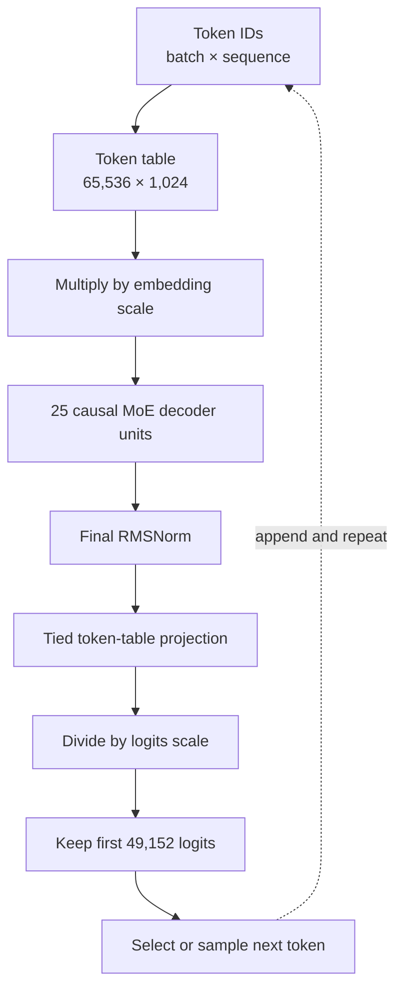

# Mixture-of-experts architecture lab

Implement `model.py` and run the supplied anonymous checkpoint using PyTorch,
without loading a pretrained-model implementation from another library. You
may use `safetensors` and `tokenizers` for file loading and tokenization.

## Required model

The checkpoint describes a decoder-only sparse mixture-of-experts Transformer.
It accepts token IDs, returns next-token logits, and supports autoregressive
generation. Read exact values from `model.json`; this artifact uses:

| Quantity | Value |
|---|---:|
| Stored vocabulary rows | 65,536 |
| Returned vocabulary logits | 49,152 |
| Hidden width | 1,024 |
| Attention query heads | 16 |
| Key/value heads | 8 |
| Width per head | 64 |
| Experts per unit | 32 |
| Selected experts per token | 8 |
| Width inside each expert | 512 |
| Executed decoder units | 25 |
| Maximum sequence length | 131,072 |

Every unit contains two pre-normalized residual branches:

```mermaid
flowchart LR
    X[Input x] --> N1[RMSNorm]
    X --> R1((+))
    N1 --> Q[Q: 16 heads<br/>K,V: 8 heads]
    Q --> A[RoPE + causal GQA]
    A --> O[Output projection × residual scale]
    O --> R1
    R1 --> Y[Intermediate y]
    Y --> N2[RMSNorm]
    Y --> R2((+))
    N2 --> ROUTE[Router 1,024 → 32]
    ROUTE --> TOP[Top 8 + softmax]
    TOP --> EXP[Selected SwiGLU experts]
    EXP --> SUM[Weighted sum × residual scale]
    SUM --> R2
    R2 --> Z[Unit output]
```

## Grouped-query causal attention

Queries have 16 heads, but keys and values have only 8. Repeat each key/value
head twice so it serves one group of query heads. Apply rotary position
information to queries and keys before repeating them. Use the explicit
attention scale from `model.json`, not PyTorch's default scale. Tokens may
attend only to valid keys at their own or earlier positions.

## Sparse expert routing

For every token independently:

1. Project the normalized token to 32 router logits in `float32`.
2. Select the eight largest logits.
3. Apply softmax only across those eight values.
4. Send the token through each selected expert.
5. Multiply each expert output by its routing probability and sum the results.

Each expert owns two bias-free matrices. The first projects 1,024 values to
1,024 values, which split into two 512-wide halves. Apply SiLU to the first
half and multiply it elementwise by the second half. The second expert matrix
projects the result back from 512 to 1,024.

The expert weights are stored together:

- `expand.weight`: `[32, 1,024, 1,024]`;
- `contract.weight`: `[32, 1,024, 512]`;
- `route.weight`: `[32, 1,024]`.

## Scaling and normalization

RMSNorm computes its variance in `float32`, then restores the input dtype
before multiplying by its learned weight. Multiply token embeddings by
`embedding_scale`. Multiply both attention and expert outputs by
`residual_scale` before their residual additions. Divide tied-projection logits
by `logits_scale`.

## Checkpoint contract

Load `safetensor_moe.safetensors`. Module names must match the neutral checkpoint
schema: `tokens`, `units`, `pre_mix`, `mix`, `pre_experts`, `experts`, `route`,
`expand`, `contract`, and `output_norm`. Instantiate and execute every unit
declared in `model.json`.

The stored token table has more rows than the tokenizer vocabulary. It is also
the output projection weight. Return only the first `vocabulary_size` logits.

## Completion criteria

- All `NotImplementedError` sites in `model.py` are implemented.
- Causal and padding masks are correct.
- Grouped-query attention uses the configured scale and rotary base.
- Routing uses top-8 softmax probabilities and combines all selected experts.
- Earlier logits do not change when later tokens are appended.
- Every checkpoint tensor loads with `strict=True`.
- `python inference.py . "Once upon a time" --max-new-tokens 20` runs.
- The implementation uses the supplied weights rather than Transformers.
